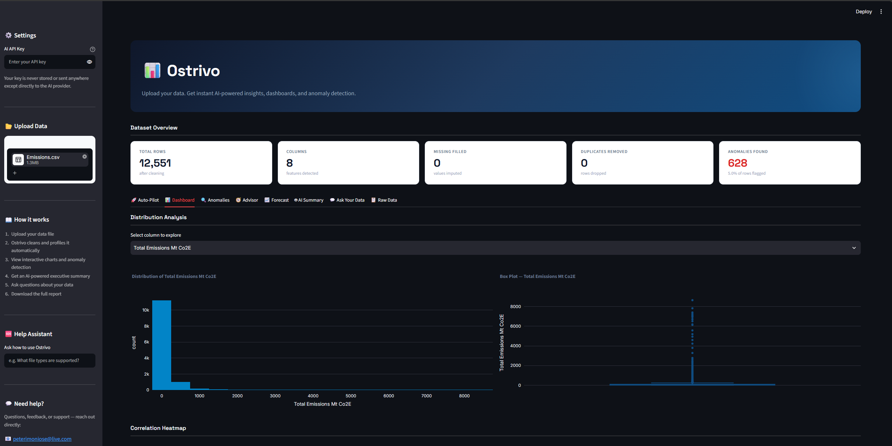

# 📊 Ostrivo

[](https://ostrivo-jdcstzn86pqn3chnhbjzf6.streamlit.app/)

> Upload your data. Get instant AI-powered insights, dashboards, and anomaly detection.

Ostrivo is an AI-powered business intelligence web app that transforms raw CSV and Excel files into interactive dashboards, anomaly detection reports, and plain-English executive summaries - in under 30 seconds.

**Live demo:** [ostrivo-jdcstzn86pqn3chnhbjzf6.streamlit.app](https://ostrivo-jdcstzn86pqn3chnhbjzf6.streamlit.app/) (also reachable at [ostrivo.app](https://ostrivo.app), which redirects here - Streamlit Community Cloud's free tier doesn't support custom domains natively, so `ostrivo.app` is a DNS-level forward, not the actual hosting URL)

---

## ✨ Features

- **Auto data cleaning** - removes duplicates, fills missing values, parses dates
- **Smart column labelling** - AI-inferred human-readable labels for cryptic column names (falls back to a heuristic without an API key), with manual override so you can rename any column yourself
- **Multi-sheet Excel support** - detects workbooks with multiple sheets, ranks them by how likely each is to be real tabular data (vs. notes/instructions/cover pages), and lets you pick which to analyse - with an optional AI opinion when a key is provided
- **Multi-file analysis** - upload several files at once (e.g. one CSV per month) and Ostrivo combines them into a single dataset, adding a `source_file` column so you can break down charts by file. Handles files with slightly different columns without erroring out.
- **Interactive dashboards** - histograms, box plots, scatter plots, correlation heatmaps, category breakdowns
- **Anomaly detection** - Isolation Forest flags unusual rows automatically
- **Advisor dashboard** - data quality scorecard plus severity-ranked recommendation cards
- **Forecasting** - trend + seasonality projection for datasets with a date column
- **AI executive summary** - automatically generates a plain-English business summary
- **Data Q&A** - ask natural language questions about your data
- **Download cleaned data** - export the cleaned CSV
- **PDF report export** - download a full report covering overview, quality scores, anomalies, recommendations, and the AI summary
- **Excel export (Power BI-ready)** - multi-sheet workbook (cleaned data, stats, anomalies) that imports cleanly into Power BI via Get Data
- **Auto-Pilot** - one-click full analysis: type an optional goal, get summary + recommendations + forecast in a single view
- **Help assistant** - a sidebar AI chatbot that answers questions about using Ostrivo itself (separate from the data Q&A)
- **Admin console** - password-gated view (`?admin=1`) with usage stats, estimated AI cost, and an activity log
- **User accounts** (optional, requires Supabase setup) - sign up / log in, save an analysis, and reload it later from "My Dashboards." Each user's saved analyses are private, enforced by Postgres Row Level Security, not just app-level checks. Session persists across page reloads via a cookie. If Supabase isn't configured, Ostrivo runs exactly as before, no login required.
- **Industry-specific analysis** - pick your industry once (Sales & Retail, Finance & Banking, or Engineering & Manufacturing) and Ostrivo tailors both the AI narrative and a dedicated "Industry Insights" tab to it: Top Performers ranking for Sales & Retail, a Concentration Risk (HHI) breakdown for Finance & Banking, and a Process Control Chart (SPC/X-chart) for Engineering & Manufacturing. Change your industry anytime from the sidebar.

---

## ✅ MVP Status

- [x] File upload (CSV + Excel, including multi-sheet workbooks and multiple files combined)
- [x] Auto data cleaning (duplicates, missing values, date parsing)
- [x] AI-powered smart column labelling with manual rename override
- [x] 5 interactive chart types (histogram, box plot, scatter, heatmap, bar)
- [x] Isolation Forest anomaly detection
- [x] Advisor dashboard (data quality scorecard + recommendation cards)
- [x] Trend/seasonality forecasting for dated datasets
- [x] AI-powered executive summary
- [x] Natural language Q&A about your data
- [x] Download cleaned data
- [x] PDF report export
- [x] Power BI-ready Excel export
- [x] Auto-Pilot one-click analysis
- [x] Sidebar help assistant
- [x] Password-gated admin console
- [x] Optional user accounts with RLS-enforced private saved dashboards
- [x] Industry-specific analysis (Sales & Retail, Finance & Banking, Engineering & Manufacturing)
- [x] Custom UI styling

---

## 🚀 Quick Start

### 1. Clone the repo
```bash
git clone https://github.com/PeterImoniose/ostrivo.git
cd ostrivo
```

### 2. Create a virtual environment and install dependencies
```bash
python -m venv .venv
.venv\Scripts\activate      # Windows
pip install -r requirements.txt
```

### 3. Run the app
```bash
streamlit run app.py
```

### 4. Open in browser
The app opens automatically at `http://localhost:8501`

### 5. Try it
Upload any CSV or Excel file - even a simple sales spreadsheet or bank export - and you'll see:
- Auto-cleaning stats (duplicates removed, missing values filled)
- Interactive charts and a correlation heatmap
- Anomaly detection results
- If you add an AI API key in the sidebar: an AI-generated executive summary and Q&A chat

---

## 🔑 API Key

Ostrivo uses an AI language model API for AI-powered summaries and Q&A.

1. Get a free API key from your AI provider account
2. Enter it in the sidebar when running the app

---

## 🔐 Admin Console

A password-gated view showing usage stats, an estimated AI API cost, and an activity log - no
customer-uploaded data is ever stored or shown here.

1. Set an `admin_password` secret: locally in `.streamlit/secrets.toml`, and on Streamlit Cloud
   under your app's **Settings → Secrets**
2. Visit `<your-app-url>/?admin=1` and enter the password - use the actual
   `ostrivo-jdcstzn86pqn3chnhbjzf6.streamlit.app` URL for this, not `ostrivo.app`, since the
   domain redirect strips query strings and would drop the `?admin=1`

---

## 👤 User Accounts (optional)

Ostrivo works with no accounts at all by default. To turn on login + saved dashboards:

1. Create a free project at [supabase.com](https://supabase.com)
2. In the Supabase SQL Editor, run the contents of [`supabase_schema.sql`](supabase_schema.sql) once -
   this creates the `saved_analyses` table with Row Level Security policies so each user can only
   ever read/write their own rows
3. From Project Settings → API, grab the **Project URL** and the **anon/publishable key** (never
   the secret/service_role key - that one bypasses Row Level Security and should never be used
   in this app)
4. Add both as secrets: locally in `.streamlit/secrets.toml`, and on Streamlit Cloud under
   **Settings → Secrets**:
   ```toml
   SUPABASE_URL = "https://your-project.supabase.co"
   SUPABASE_ANON_KEY = "your-anon-key"
   ```
Once set, the app requires an account. Signing up asks for a full name, email, and password
(at least 8 characters with an uppercase letter, a lowercase letter, and a number, entered twice
to confirm the match). After signup, the account is inactive until a verification code emailed
by Supabase is entered in the app - verifying it both confirms the account and logs the user in.
Saved analyses store the cleaned dataset and computed results (quality scores, anomalies, AI
summary) - not the original uploaded file.

### Email delivery (custom SMTP)

Supabase's built-in email service caps out at 2 emails/hour project-wide and doesn't allow
editing any email template - both blockers for real signups. Ostrivo uses custom SMTP through
[Brevo](https://www.brevo.com) (free tier) instead, which requires a verified domain (Brevo
won't send to real recipients otherwise - true of every major provider, not Brevo-specific):

1. Own a domain and verify it in Brevo (Senders, Domains & Dedicated IPs → Domains → Add a
   domain), adding the DNS records Brevo provides (a TXT ownership record, DKIM CNAMEs, and
   optionally a DMARC record and a branded-link subdomain)
2. Set up custom SMTP under Supabase's **Authentication → Emails → SMTP Settings**:
   host `smtp-relay.brevo.com`, port `587`, the SMTP login/key from Brevo's SMTP & API page,
   and a sender email at your verified domain (e.g. `no-reply@yourdomain.com`)
3. In the Supabase dashboard, go to **Authentication → Emails → Templates → Confirm signup**
   and replace the body with:
   ```html
   <h2>Confirm your signup</h2>
   <p>Enter this code in Ostrivo to activate your account:</p>
   <h1 style="letter-spacing: 4px; font-size: 32px;">{{ .Token }}</h1>
   <p>If you didn't try to create an account, you can safely ignore this email.</p>
   ```
   Note: Supabase's generated code isn't always exactly 6 digits (Ostrivo's own project has seen
   8-digit codes) - don't assume a fixed length anywhere in the UI or validation.

---

## 🏭 Industry-Specific Analysis

Once logged in, pick your industry from the signup form (or change it anytime from the sidebar).
Ostrivo stores the choice in your account's Supabase user metadata - no extra table needed - and
uses it to tailor both the AI-generated wording and a dedicated **Industry Insights** tab:

| Industry | Industry Insights tab shows |
|---|---|
| Sales & Retail Business | Top Performers - ranks a category (product, region, etc.) by a chosen metric |
| Finance & Banking | Concentration Risk - Herfindahl-Hirschman Index (HHI) and risk level across a category/amount breakdown |
| Engineering & Manufacturing | Process Control Chart - standard SPC (X-chart) with center line, control limits, and out-of-control points |

Guest/no-login mode still works with no industry set, showing the original general-purpose analysis.

---

## 🧪 Testing

Core data-processing logic (cleaning, anomaly detection, forecasting, quality scoring, PDF/Excel
generation) lives in `ostrivo_core.py`, kept free of Streamlit and network dependencies so it can
be unit tested directly:

```bash
pip install pytest
pytest tests/
```

CI runs these tests automatically on every push via GitHub Actions.

---

## 📁 Supported File Types

- `.csv` - comma-separated values
- `.xlsx` - Excel (modern format)
- `.xls` - Excel (legacy format)

---

## 🛠️ Tech Stack

| Layer | Technology |
|---|---|
| Frontend | Streamlit |
| Data processing | pandas, NumPy |
| Machine learning | scikit-learn (Isolation Forest) |
| Visualisation | Plotly |
| AI | Large Language Model API |
| Statistics | SciPy |
| Reporting | fpdf2 (PDF export), xlsxwriter (Excel export) |
| Activity logging | SQLite |
| Auth & user data | Supabase (Postgres + Auth, Row Level Security) |
| Testing | pytest, GitHub Actions CI |

---

## 📸 Screenshots



Upload any CSV or Excel → instant dashboard, anomaly detection, and AI summary.

---

## 🗺️ Roadmap

- [ ] Email alerts for anomalies
- [ ] Multi-file comparison
- [ ] More industries (healthcare, logistics, etc.)
- [ ] Portfolio website showcasing the project

---

## 👤 Author

**Avwerosuo Peter Imoniose**  
MSc Applied Data Science in Engineering (Distinction) - Glasgow Caledonian University, 2026  
[LinkedIn](https://www.linkedin.com/in/avwerosuo-imoniose-bbb3b915a) · [GitHub](https://github.com/PeterImoniose)

---

## 📄 Licence

MIT
